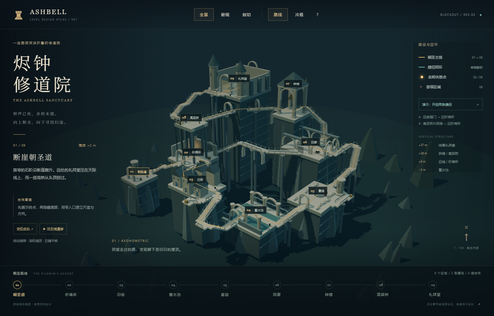

# 烬钟修道院 · Ashbell Sanctuary

[在线体验](https://mathway18.github.io/ashbell-sanctuary/) · [低模 GLB](https://mathway18.github.io/ashbell-sanctuary/Ashbell-Sanctuary.glb)

原创魂系线性箱庭的低模空间设计。直接双击 `index.html`，使用 Edge / Chrome 打开；HTML 约 679 KB，包含全部脚本与样式，无需联网或安装依赖。`Ashbell-Sanctuary.glb` 为可导入 Blender、Godot 等工具的独立场景模型。

## 第二版优化

坡道在平台外完成爬升，再通过平层落点接入；转角栏杆根据道路交点留出开口。礼拜堂地基先合并，再切出真实的贯通隧道，避免内部重合面。升降梯改成独立梯井与有开口的上层楼板。旧街房屋具备空心墙体与门洞，石拱、双坡屋顶、桥下拱券和蓄水池水面高度也已重做。

在帮助菜单中可直接选择“查看穿行隧道”和“查看升降梯井”。

## 空间设计

整图沿深渊边缘折叠：朝圣道 → 旧祈祷所 → 倾斜旧街 → 无光蓄水池 → 守墓人庭院 → 灰枝回廊 → 失声钟楼 → 悬空赎罪桥 → 终焉礼拜堂。

主线保持固定先后顺序，通过弯折、下沉、回升与两条捷径创造空间密度。两条奖励支路分别位于旧街与墓庭，终止于金色宝箱体块，不改变主线顺序。

- **开场预告终点**：礼拜堂与钟楼组成最高轮廓，从入口即可辨认。朝圣者看到目标，但必须先下降到蓄水池，再从东侧绕回高处。
- **先展示不可用的连接**：旧祈祷所作为初始中枢，侧门与头顶的升降梯预告未来的回归。
- **第一次回环**：到达灰枝回廊后，从远侧打开横桥门，沿横桥与石阶返回旧祈祷所。主线探索之后，原本漫长的路变成短连接。
- **第二次回环**：悬空赎罪桥在平面上与旧祈祷所重叠，高差 20 m。到达高桥后启动升降梯，最终挑战前获得直接返回初始休憩点的路线。
- **压力节奏**：窄入口 → 安全休憩 → 房屋夹道 → 低处水池 → 开阔精英遭遇 → 回廊休憩 → 钟楼全景 → 高桥捷径 → 雾门首领。
- **认知奖励**：钟楼高点把入口、旧街、水池与捷径同时纳入视野；高桥兑现“原来开场头顶就是这里”的空间关系。

## 概念尺度

以 1 个场景单位约为 1 m 设计。九个区域的地面高度依次为 +2、+8、+10、−2、+2、+15、+27、+28、+37 m；总高差 39 m。主线中心线约 465 m，普通桥面宽 3.6 m，楼梯单级高不超过 0.24 m。海面位于 −18 m。

这些尺度用于关卡空间原型，不是建筑施工规范。敌人、首领、篝火和宝箱使用符号化低模占位；战斗压力与奖励安排是关卡设计意图，没有实现战斗系统。

## 页面操作

| 操作 | 功能 |
| --- | --- |
| 左键拖动 / 滚轮 / 右键拖动 | 旋转 / 缩放 / 平移 |
| 场景编号 / 底部章节 | 阅读区域设计 |
| 定位此处 | 镜头移动至当前区域 |
| 全景 / 俯视 | 查看立体层次与平面拓扑 |
| 剖切 | 隐藏高墙、屋顶与部分高层体块 |
| 路线 | 开关金色主线、青色捷径叠加 |
| 冷昼 / 暮色 | 调整光照 |
| 开启两条捷径 | 打开门并播放升降梯往复演示 |
| 沿主线漫游 | 以 1.85 m 视高、约 4.2 m/s 自动导览 |
| 漫游时空格 / Esc | 暂停继续 / 返回全景 |
| ? → 导出低模场景 | 导出当前场景 GLB |

漫游是按路线点插值的设计导览，约 111 秒；不包含自由行走、碰撞、战斗、角色动画或存档。捷径按钮用于展示设计关系，不是玩家进度系统。GLB 包含建筑、地形、水面与实体连接；HTML 中的标签、路线叠加、灯光与交互逻辑不包含在 GLB 内。GLB 由页面自动验收时导出，后续也可通过页面重新导出。

## 文件与复现

- `index.html`：独立完整展示页，可单独复制分享。
- `Ashbell-Sanctuary.glb`：低模场景。
- `src.js`：区域数据、路网、程序化模型、相机与交互。
- `style.css` / `shell.html`：页面源文件。
- `build.cjs`：将 Three.js、场景脚本与 CSS 嵌入一个 HTML。
- `overview.png` / `plan-cutaway.png` / `cloister-detail.png` / `walkthrough.png` / `mobile.png`：浏览器实拍。
- `VERIFY.md`：离线浏览器交互、全路线导览与几何验收摘要。
- `model-tools.js`：平台转折与实体布尔建模工具。
- `route-audit.js`：通行净空与脚下支撑的几何采样检查。
- `THREE-LICENSE.txt` / `CSG-LICENSE.txt` / `MESH-BVH-LICENSE.txt`：随附依赖许可。

修改后在本目录执行 `npm install` 与 `npm run build`。完整浏览器与几何验收结果见 `VERIFY.md`。运行展示本身无需 Node.js。
